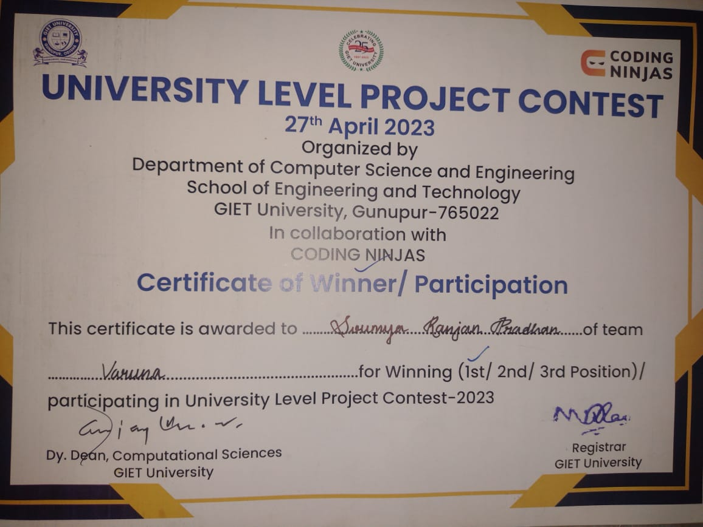
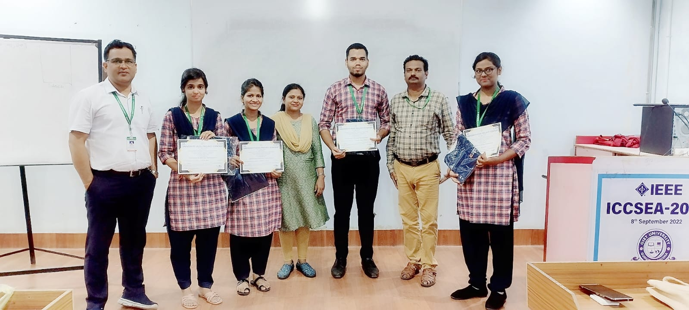
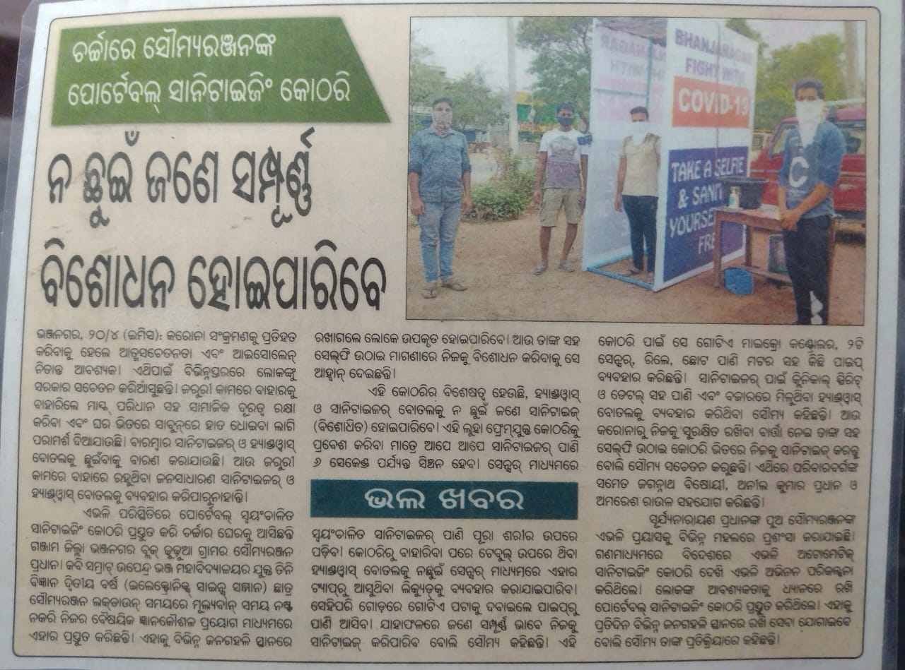

## Achievments 

University level project contest winner 2023

## Invented a ground breaking sanitizing tunnel and sanitizer machines during the COVID-19
## pandemic, featured on two national news channels and recognized by three local
## newspapers for its significant impact on public health.April-2020

## Kalinga TV

https://youtu.be/6J2dRMDGYaA?si=L1qHCqnN88L9yYFe

## kanak news
https://youtu.be/3oyCVokEoLQ?si=2CP6eg0G19vrcprv

## Sambad newspaper

